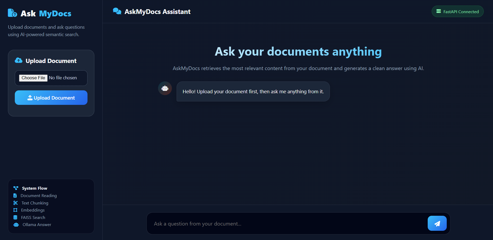

# 🤖 ASK MYDOCS

<p align="center">

  <strong>Ask questions. Find answers. Explore your documents.</strong>

</p>

<p align="center">

  An AI-powered Retrieval-Augmented Generation (RAG) assistant for intelligent document search and question answering.

</p>

<p align="center">

  

</p>

---

## 📌 Overview

**ASK MYDOCS** is an AI-powered document assistant that lets users interact with their documents using natural language.

Instead of manually searching through long documents, users can upload files directly or synchronize supported documents from **Google Drive** and simply ask questions about their content.

Under the hood, ASK MYDOCS uses a **Retrieval-Augmented Generation (RAG)** pipeline. Documents are converted into clean, manageable text chunks and transformed into semantic embeddings using **Sentence Transformers**. These embeddings are indexed in **FAISS**, allowing the system to retrieve the most relevant pieces of information for each question.

The retrieved content is then re-ranked and provided as context to a locally running **Ollama LLM**, which generates a focused answer based on the available document context.

### 💡 In Simple Terms

> **Bring your documents → ASK MYDOCS finds the relevant information → Ask your question → Get an AI-generated answer with its source.**

---

## 💡 Why ASK MYDOCS?

Working with large documents often means spending time searching through pages of information to find a specific answer.

**ASK MYDOCS** provides a simpler way to interact with that information — just ask a question in natural language and let the system find the relevant content for you.

With ASK MYDOCS, users can:

- 📂 **Bring documents from multiple sources** — upload files locally or synchronize supported documents from Google Drive.
- 💬 **Ask naturally** — interact with documents using everyday questions instead of manually searching through pages.
- 🔎 **Find relevant information** — semantic retrieval helps identify content based on meaning and context.
- 🎯 **Get focused answers** — only the most relevant retrieved content is provided to the language model.
- 🛡️ **Get more grounded answers** — the LLM receives relevant document context before generating a response, helping reduce hallucinations and unsupported information.
- 📚 **Trace the information** — responses include source metadata to identify the document and retrieved chunk.
- 🔄 **Keep Drive content synchronized** — new and modified documents can be processed while unchanged documents can be skipped.

---

# ✨ Key Features

- 📄 Upload PDF, DOCX, and TXT documents
- ☁️ Connect and synchronize supported documents from Google Drive
- 🔐 Google Drive OAuth 2.0 authentication
- 🔄 Incremental Google Drive synchronization
- 📝 Google Docs support
- 🧹 Automatic text extraction and cleaning
- ✂️ Overlapping text chunking
- 🧠 Sentence Transformer embeddings
- ⚡ FAISS vector similarity search
- 🎯 Relevant chunk re-ranking
- 🛡️ Grounded responses to help reduce hallucinations
- 🤖 Local LLM inference using Ollama
- 📚 Source-aware responses
- 🆔 Document and chunk metadata
- 🌐 FastAPI REST APIs
- 📖 Swagger/OpenAPI documentation
- 💬 Interactive web interface

---

# 🏗️ System Architecture

ASK MYDOCS accepts documents from two sources: **Local Upload** and **Google Drive**.

Google Drive documents are accessed through **OAuth 2.0 authentication** before entering the same document processing pipeline.

```text
                         DOCUMENT SOURCES
                                │
                 ┌──────────────┴──────────────┐
                 │                             │
                 ▼                             ▼
          Local Upload                  Google Drive
                 │                             │
                 │                       OAuth 2.0
                 │                             │
                 │                             ▼
                 │                      Google Drive API
                 │                             │
                 └──────────────┬──────────────┘
                                ▼
                       Text Extraction
                                │
                                ▼
                         Text Cleaning
                                │
                                ▼
                            Chunking
                                │
                                ▼
                     Sentence Embeddings
                                │
                                ▼
                             FAISS
                                │
                                ▼
                    Semantic Retrieval
                                │
                                ▼
                         Re-ranking
                                │
                                ▼
                      Retrieved Context
                                │
                                ▼
                           Ollama LLM
                                │
                                ▼
                    Answer + Source Metadata
```

---


**Turn your documents into an interactive knowledge base.**